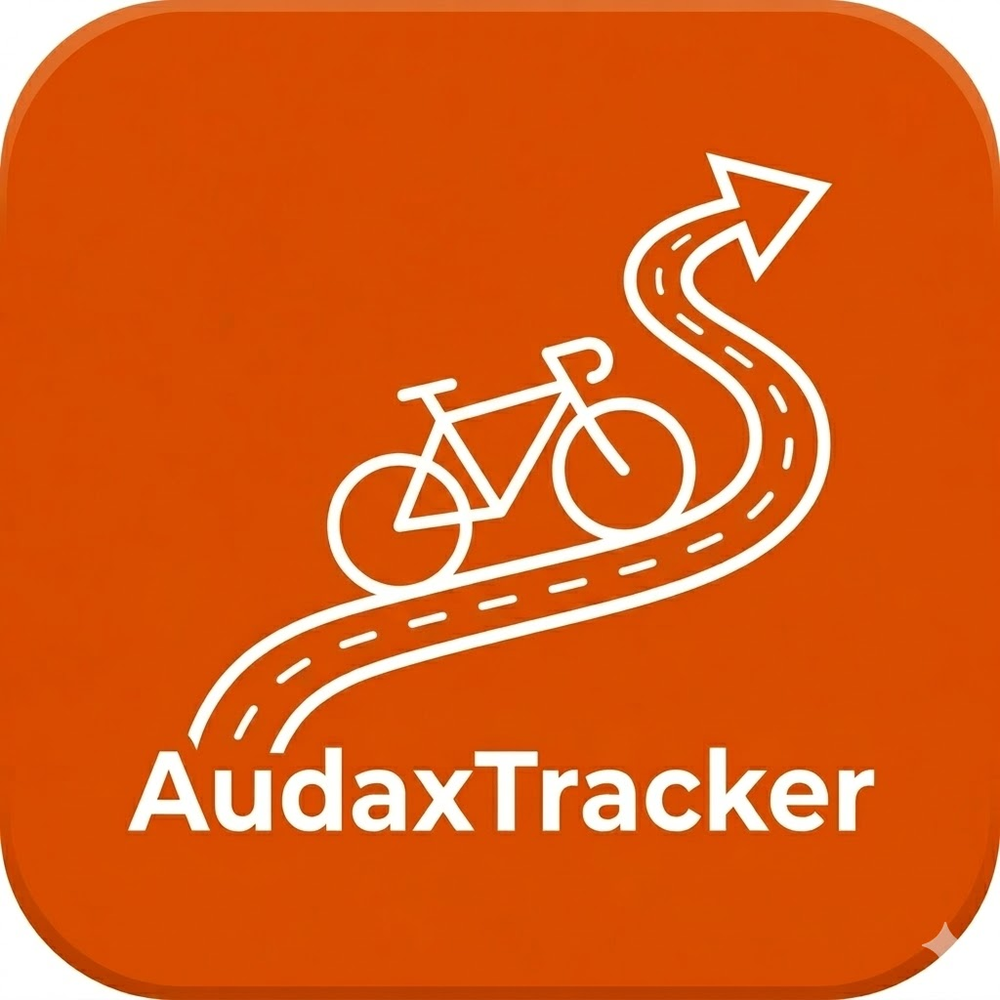

  

# Audax Tracker

A web app that pulls cycling activities from Strava, classifies qualifying audax/randonneuring events, and tracks progress toward a range of annual and lifetime awards.

## Features

### Strava Integration

- **OAuth sync** — login with Strava, bulk-import full ride history, incremental sync on return visits
- **Auto-classification** — detects BRM brevets, PBP, Flèche, SR600, and other event types from ride name/description using regex patterns or a distance heuristic
- **Manual override** — reclassify any activity and attach a homologation number via the Activities page
- **DNF detection** — auto-detects Did Not Finish from activity names, with manual override

### Annual Awards

Tracked per season (November–October):

- **Super Randonneur** — complete a 200, 300, 400, and 600 km brevet in the same season; SR600 counts as the 600
- **RRTY (Randonneur Round The Year)** — ride at least one qualifying event (≥200 km) every month for 12 consecutive months
- **Brevet 2000 / 5000** — accumulate 2,000 or 5,000 km from brevet-type rides in a single season
- **4 Provinces of Ireland** — complete a qualifying ride starting in each of the four provinces (Ulster, Leinster, Munster, Connacht) in the same season
- **Easter Flèche** — complete a Flèche event during the Easter weekend (Good Friday to Easter Monday)

### Lifetime Awards

- **4 Nations Super Randonneur** — complete a 200, 300, 400, and 600 km brevet each in a different nation: Ireland, England, Scotland, and Wales
- **International Super Randonneur (ISR)** — complete a 200, 300, 400, and 600 km brevet each in a different country
- **International rides log** — a chronological log of qualifying rides held outside Ireland

### Summary & Tracking

- **Yearly summary** — per-year totals and a table of all qualifying events
- **Offline-first** — all data cached locally in IndexedDB (Dexie.js); no server-side database

## Development

For architecture, tech stack, project structure, local setup, and deployment instructions, see [docs/development.md](docs/development.md).

## Classification Logic

Activities are classified in order:

1. **Name/description parsing** — regex match on ride name for patterns like `BRM`, `Brevet`, `PBP`, `Paris-Brest`, `Fleche`, etc.
2. **Distance heuristic** — rides in qualifying distance ranges flagged as candidates (e.g. 195–210 km → BRM200)
3. **Manual override** — user can reclassify any ride and add a homologation number via the Activities page

### Northern Ireland

Rides in Northern Ireland are geocoded by OpenStreetMap/Nominatim as `United Kingdom`, but for all award tracking purposes the app treats the entire island of Ireland as a single entity called "Ireland". Concretely:

- A ride starting and/or ending in Northern Ireland counts as **Ireland** (province: Ulster) for the 4 Provinces award and the 4 Nations SR.
- Northern Ireland rides do **not** appear in the international rides log.
- Any rides already stored with `country = United Kingdom / region = Northern Ireland` are automatically re-geocoded to `Ireland / Ulster` on the next Strava sync.
